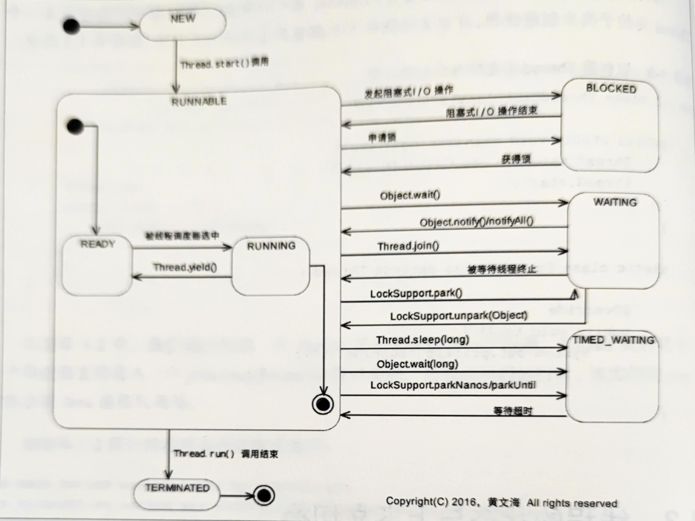

# java学习笔记  
> <<java多线程编程实战指南-第二版>>

## 基础理论
- Java中的线程分为<b>守护线程</b>（Daemon Thread）和<b>用户线程</b>(User Thread)， 其中用户线程会影响Java虚拟机的正常停止，即java虚拟机停止前所有的用户线程都必须停止。守护线程不影响Java虚拟机的正常停止。
- 线程的属性通常由父线程决定，父线程是守护线程则子线程也是，用户线程同理。也可以通过setDaemon方法来修改。

## 线程的生命周期

- <b>NEW</b>:创建状态，线程刚创建未启动时的状态。一个线程对象只能创建一次，因此一个线程只可能处于该状态一次。
- <b>RUNNABLE</b>:运行状态，该状态包含两个子状态READY和RUNNING，线程被调度时，为RUNNING状态，即线程中的run()中的代码正在CPU中运行，当Thread实例的yield()被调用时，处于READY状态。
- <b>BLOCKED</b>:阻塞状态，当线程被IO阻塞或者被其他线程的锁阻塞时，处于此状态，当阻塞结束后，返回RUNNABLE状态。
- <b>WAITING</b>:无限等待状态，处于等待其他线程执行特定操作的状态。
- <b>TIMED_WAITING</b>:有限等待状态，与WAITING的区别在于，此状态有时间限制，当其他线程没有在指定时间内完成操作时，该线程自动切换为RUNNABLE。
- <b>TERMINATED</b>:结束状态，一个线程只能处于该状态一次。当run() 方法正常返回或异常终止之后，都处于此状态。

注：从RUNNABLE切换到BLOCKED、WAITING、TIMED_WAITING都意味着上下文（Context）切换。

## 原子性、内存可见性、重排序
- **概念**：
     - **原子性**：对于涉及共享变量的操作，对外部线程来看是密不可分的，则为原子操作。 i++不是原子操作，该操作实际可以分为三个子操作：将变量i加载到寄存器中，将寄存器中的值+1，将寄存器中的值写回变量。
     - **内存可见行**：CPU在执行代码的时候，为了降低变量访问的时间开销，可能将代码中访问的变量值缓存到该CPU的高速缓存（如L1 Cache、L2 Cache等）中。因此当相应代码再次访问某个变量时，相应的值可能是从CPU的高速缓存而不是主内存中读取的。同样地，出于对内存访问效率的考虑，代码对变量值的修改也可能仅被写入执行这段代码的CPU上的写缓冲器（ Store Buffer）里，而没有被写入该PU的高速缓存里，更没有被写入主内存里。由于每个CPU都有自己的高速缓存，而一个CPU并不能直接读取其他CPU上的高速缓存里的内容，这就导致一个线程对共享变量所做的更新可能无法被其他CPU上运行的其他线程“看到”。这就是所谓的内存可见性。
- **synchronized**关键字：该关键字可以实现操作的原子性和内存可见性。
   - 原理：该关键字所限定的临界区具有排他性，能保证在任一时刻只有一个线程可以执行该临界区中的代码。从而保证了原子性。该关键字还有另一个作用就是保证了一个线程对共享变量的修改对稍后执行该临界区中的代码的线程来说是可见的。
- **volatile**关键字：该关键字也能够保存内存可见性。即一个线程对采用了volatile修饰的变量的值的修改，对其他线程内存可见。
   - 原理：volatile关键字保障内存可见性的核心机制是，当一个线程修改了一个 volatile关键字修饰的变量的值时，该值会被写入当前线程所在的CPU上的高速缓存里，而不是仅仅停留在该CPU的写缓冲器里，而其他CPU上的高速缓存里存储的该变量的值（副本）也会因此而失效。这就保证了这些其他线程再访问该 volatile关键字修饰的变量时总是可以通过处理器的缓存一致性协议（ Coherence Protocol）来获取该变量的最新值。
   - 另外的作用：禁止了重排序。